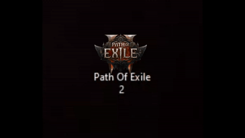
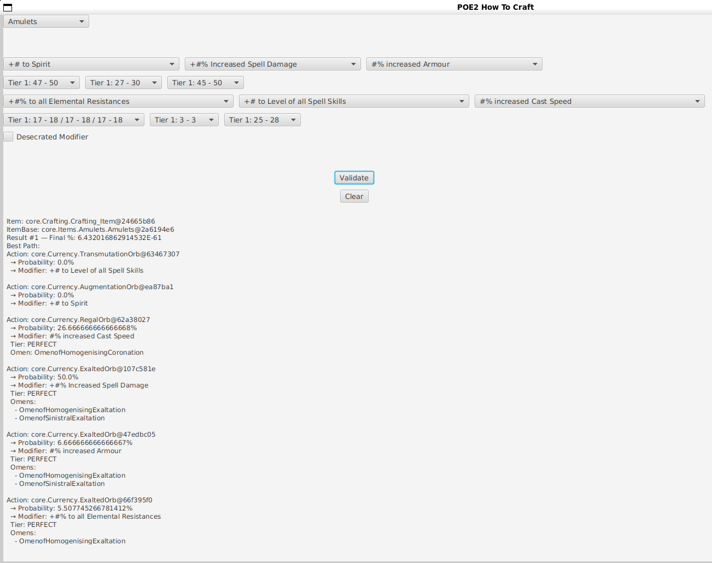
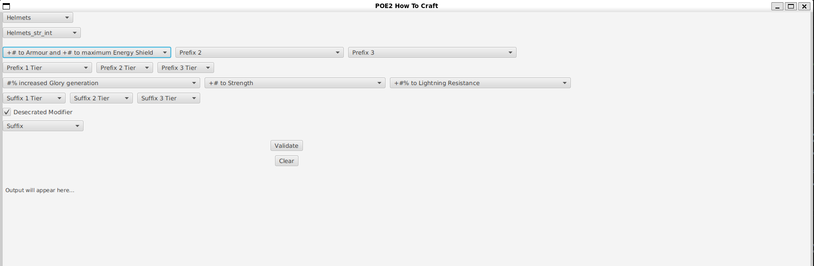

# POE2 How To Craft


POE2 How To Craft is a JavaFX software that computes the most deterministic paths to craft desired items in **Path of Exile 2**.

**Status:** Work in progress (~80% complete), functional but still lacks some features and polishing before releasing it in 1.0.  
This project will continue to be updated alongside new content from GGG, with updates expected each league/season, making it a long-term project.  
Contributions to this project are very welcome!


(*I started this project to showcase it on my resume while searching for an internship, but it won't be finished in time before January.  
If you are looking for an intern in software development or AI for January (preferably in France), feel free to view my other projects and contact me.*)


**Topics:** Java, JavaFX, POE2, Crafting, BeamSearch, GameTools, OpenSource

## Table of Contents
- [Features](#features)
- [Requirements](#requirements)
- [Getting Started](#getting-started)
- [How It Works](#how-it-works)
- [Screenshots of the GUI](#screenshots-of-the-gui)
- [Contributing](#contributing)
- [To Improve / Fix / Test](#to-improve--fix--test)
- [Bug Reporting](#bug-reporting)
- [License](#license)
- [Contact](#contact)

---

## Features

- Determine the optimal crafting paths for items  
- Compute modifier probabilities and best paths  
- Support all currencies and omens  
- Multithreaded computation for faster processing  

---

## Requirements

- Java 21+  
- JavaFX 21+  
- Apache Maven 3.8+  

---

## Getting Started


Follow these steps to set up and launch the project locally:

1. **Clone the repository**
```bash
git clone https://github.com/<your-username>/POE2-How-To-Craft.git
cd POE2-How-To-Craft
```

2. **Check Java and Maven versions**
```bash
java -version
mvn -v
```

Make sure Java 21+ and Maven 3.8+ are installed.

3. **Clean and build the project**
```bash
mvn clean
```

4. **Run `the project**
```bash
mvn javafx:run
```
	
---

## How It Works

The software uses a **beam search algorithm**:

1. Score all possible modifier outcomes (desired modifiers = 1000 points, undesired modifiers with relevant tags = 250 points).
2. Keep top candidates at each step: Transmute → Augment → Regal -> etc...  
3. Calculate probabilities for each path.  
4. Continue until 6-modifier items are found and sorted by probability.  

Special handling for Normal mods obtained by desecrations is implemented with approximations.  

---

## Screenshots of the GUI




---


## Contributing

1. Fork the repository  
2. Clone your fork locally  
3. Make changes, add features, fix bugs  
4. Create a pull request  

If you’re new, start with small things like:
- Fixing typos in the GUI or database
- Adding docstrings
- Improving existing functions for clarity

Please follow coding standards and add docstrings where possible.  

---

## To Improve / Fix / Test


- Bug Testing / Bug Fixing
- Checking the database for discrepancies
- Improve GUI
- Improve the probability part
- Optimize the beam search algorithm for better performance

---

## Bug Reporting

If you find a bug or encounter unexpected behavior:

1. Go to the [Issues](https://github.com/Dboire9/POE2_HTC/issues) tab.
2. Click **New Issue** and describe the problem clearly.
3. Include steps to reproduce the bug, screenshots, and your system info if possible.
4. We’ll track and fix it as soon as possible!

Contributors can submit pull requests to fix reported bugs.

---

## License

This project is licensed under **GPLv3**. See the LICENSE file for details.  

---

## Contact

If you have questions or want to contribute:  
- Discord: .doboy9
