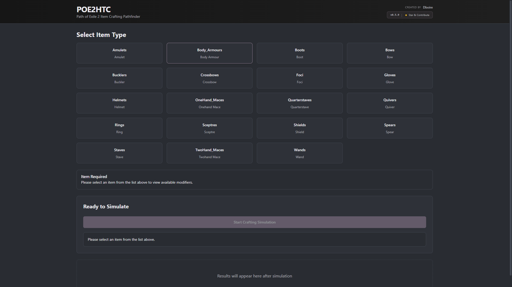
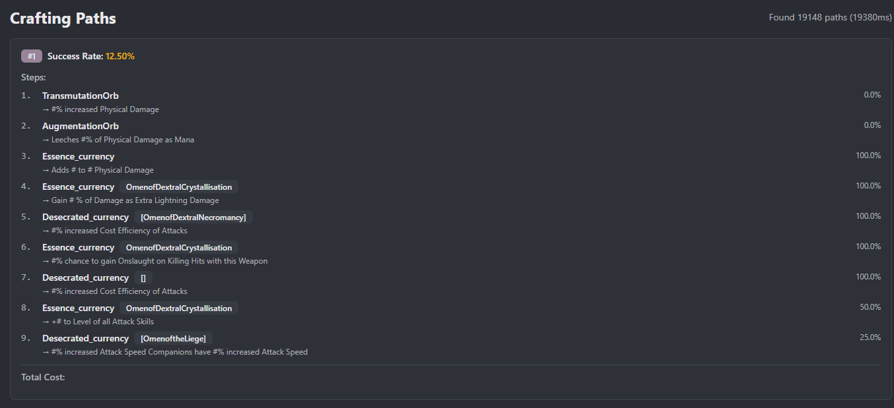

# POE2 How To Craft

<div align="center">


</div>

A powerful desktop application that calculates optimal crafting paths for **Path of Exile 2** items. Find the most efficient way to craft your dream items using advanced algorithms and probability calculations.

<div style="display: flex; gap: 10px;">
  
  
</div>

## 📑 Table of Contents

- [✨ Features](#-features)
- [🚀 Quick Start](#-quick-start)
- [👤 About Me & the Project](#-about-me--the-project)
- [📖 How Does It Work?](#-how-does-it-work)
- [💻 Development](#-development)
- [🤝 Contributing](#-contributing)
- [📝 API Documentation](#-api-documentation)
- [🐛 Known Issues](#-known-issues)
- [🗺️ Roadmap](#️-roadmap)
- [📄 License](#-license)
- [🙏 Acknowledgments](#-acknowledgments)
- [📞 Contact](#-contact)

## ✨ Features

- 🎯 **Optimal Crafting Paths** - Find the best sequence of currencies to craft your desired item
- 📊 **Probability Calculations** - See exact success rates for each crafting step
- ⚡ **Fast Computation** - Multithreaded beam search algorithm for quick results
- 🖥️ **Desktop App** - Run locally with Electron or in your browser

## 🚀 Quick Start

### Windows Users

**Download the installer:**

1. Go to [Releases](https://github.com/Dboire9/POE2_HTC/releases/latest)
2. Download `POE2HTC-Setup-X.X.X.exe`
3. Run the installer
4. Launch POE2 HTC from your Start Menu or Desktop

**⚠️ Important:** The application is currently **not signed** (I'm working on getting a code signing certificate). Windows will show a security warning when you run the installer. You'll need to click "More info" and then "Run anyway" to proceed with the installation. This is normal for unsigned applications and doesn't indicate any security risk. You can review the source code on GitHub if you have any concerns.

- The installer includes everything you need!

### Linux/macOS Users

**Prerequisites**: Java 17+, Node.js 20+, Maven 3.8+

```bash
# Clone and setup
git clone https://github.com/Dboire9/POE2_HTC.git
cd POE2_HTC
npm install --legacy-peer-deps

# Run the Electron desktop app
npm run electron:dev
```

### If you need some help or want to join the community, join us on [Discord](https://discord.gg/RvxCWyFF3D).

---

## 👤 About Me & the Project

Hi! I'm **Dorian**, a third-year computer science student at **42 Paris**.

I built this project while (still) actively searching for an internship, both to strengthen my skills and to add a meaningful, technical project to my portfolio. As someone passionate about both gaming and software development, combining Path of Exile 2's complex crafting system with algorithm optimization was the perfect challenge.

**Why this project?**
- 🎓 Demonstrates full-stack development skills (Java, React, TypeScript, Electron)
- 🧠 Showcases algorithm design and optimization (Beam Search, multithreading)
- 🎮 Solves a real problem for the PoE2 community
- 📈 Continuous learning through community feedback

**Looking for opportunities:**  
I'm currently seeking an **internship or freelance opportunities** — a required step for completing my diploma at 42. If you appreciate my work or think my skills could be useful to your team, feel free to reach out!

**📘 For more about my journey, motivation, and project philosophy, see [About Me & the Project](docs/ABOUT.md).**

---

## 📖 How Does It Work?

This tool simulates Path of Exile 2 crafting to find the most efficient paths to your desired item:

1. **Select** your base item type and desired modifiers (prefixes/suffixes)
2. **Simulate** using the Beam Search algorithm to explore millions of crafting sequences
3. **Review** ranked paths with step-by-step instructions and success probabilities
4. **Craft** in-game following the optimal currency sequence

The simulation accounts for item rarity transitions, modifier weights, currency behaviors, family conflicts, and slot limitations to provide accurate probability calculations.

**📘 For detailed usage instructions with screenshots and examples, see the [User Guide](docs/USER_GUIDE.md).** 

---

## 💻 Development

**Quick Start:**
```bash
# Clone and install dependencies
git clone https://github.com/Dboire9/POE2_HTC.git
cd POE2_HTC
npm install --legacy-peer-deps

# Run development environment (starts both backend and frontend)
npm run electron:dev
```

**Architecture:**
- **Frontend**: React 19 + TypeScript + Vite + Electron
- **Backend**: Java 17 + Maven, REST API on port 8080
- **Algorithm**: Beam Search with heuristic scoring and multithreading

**📘 For detailed setup instructions, project structure, and contribution guidelines, see the [Development Guide](docs/DEVELOPMENT.md).**

### Beam Search Algorithm

The crafting optimizer uses a **modified Beam Search algorithm** to find optimal crafting sequences. It explores millions of possible paths while pruning low-probability outcomes, achieving near-optimal results in seconds even for complex 6-modifier crafts.

**Key features:**
- Parallel state exploration with intelligent pruning
- Heuristic-guided path selection
- Exact probability calculations for each step
- Multithreaded execution for sub-10-second results

> 📖 **[Read the full algorithm explanation →](docs/ALGORITHM.md)**

---

## 🤝 Contributing

We welcome contributions! Here's how you can help:

1. **Report Bugs** - Open an issue with reproduction steps  
2. **Suggest Features** - Share your ideas for improvements  
3. **Submit Pull Requests** - Fix bugs or add features  
4. **Update Data** - Help keep modifier data current with game patches

**📘 For detailed contribution guidelines, development setup, and code style, see the [Contributing Guide](docs/CONTRIBUTING.md).**

---

## 📝 API Documentation

See [API_EXAMPLES.md](docs/API_EXAMPLES.md) for detailed API usage and examples.

## 🔄 Auto-Update System

The desktop application includes automatic update notifications:
- Checks for updates automatically on launch
- Download updates in the background
- Install with a single click
- No need to manually download new versions

See [AUTO_UPDATE.md](docs/AUTO_UPDATE.md) for technical details.

## 🐛 Known Issues

- Some rare edge cases with essence combinations may not be fully optimized

See the [Issues](https://github.com/Dboire9/POE2_HTC/issues) page for a complete list.

## 🗺️ Roadmap

- [x] Desktop application with Electron
- [x] Auto-update system
- [x] Multi-platform support (Windows, Linux)
- [ ] Add crafting cost estimation
- [ ] Crafting simulator with step-by-step execution
- [ ] Integration with trade API for cost optimization

## 📄 License

This project is licensed under the GNU Affero General Public License v3.0 (AGPL-3.0) - see the [LICENSE](LICENSE) file for details.

## 🙏 Acknowledgments

- Grinding Gear Games for creating Path of Exile 2
- The PoE community and POE2db for modifier data and crafting knowledge
- [@traylorre](https://github.com/traylorre) and [@fZpHr](https://github.com/fZpHr) for the help and advices.

## 📞 Contact

- **Issues**: [GitHub Issues](https://github.com/Dboire9/POE2_HTC/issues)
- **Discussions**: [GitHub Discussions](https://github.com/Dboire9/POE2_HTC/discussions)

---

**Note**: This is a third-party tool and is not affiliated with or endorsed by Grinding Gear Games.
