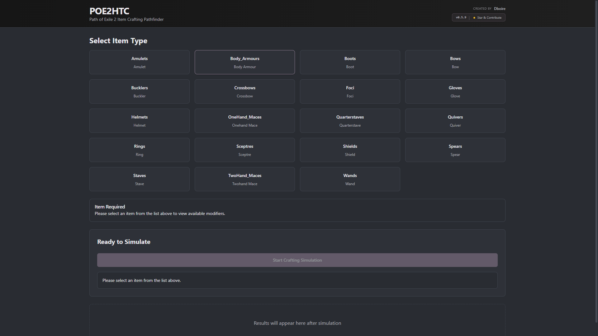
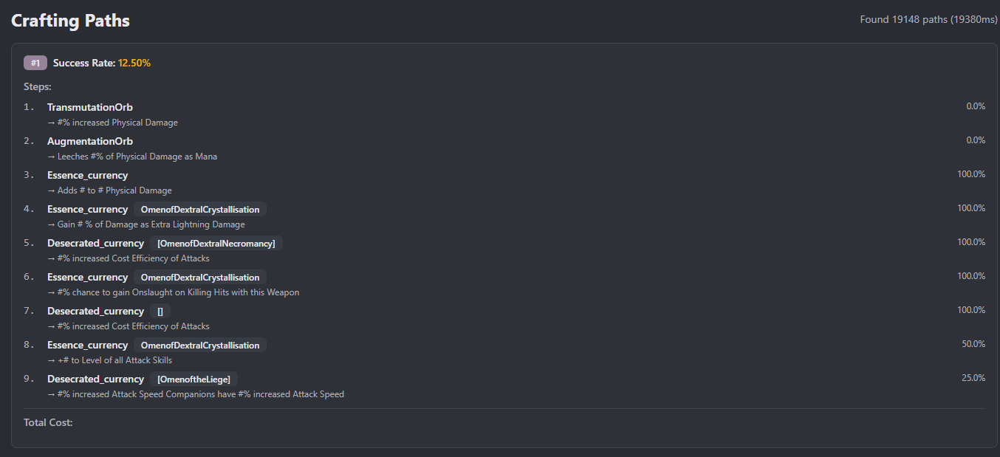

# POE2 How To Craft

<div align="center">


</div>

A web app that works out **how to craft the item you want in Path of Exile 2**, and what it will cost.
It runs the probability math exactly — no simulation, no sampling — over the real 0.5.0 modifier pools,
prices every route from a live poe.ninja sheet, and shows you the trade-off between the cheapest way and
the surest way. Everything runs in your browser; there is no server and nothing to install.

## 🌐 Web Application

**Try it now at [poe2htc.com](https://poe2htc.com)** - No installation required!

<a href="https://buymeacoffee.com/dboire" target="_blank"></a>

*If you find this tool helpful, consider supporting its development!*

<div style="display: flex; gap: 10px;">
  
  
</div>

## Join us on [Discord](https://discord.gg/RvxCWyFF3D).

## 📑 Table of Contents

- [✨ Features](#-features)
- [🚀 Quick Start](#-quick-start)
- [👤 About Me & the Project](#-about-me--the-project)
- [📖 How Does It Work?](#-how-does-it-work)
- [💻 Development](#-development)
- [🤝 Contributing](#-contributing)
- [📝 API Documentation](#-api-documentation)
- [🐛 Known Issues](#-known-issues)
- [🗺️ Roadmap](#️-roadmap)
- [📄 License](#-license)
- [🙏 Acknowledgments](#-acknowledgments)
- [📞 Contact](#-contact)

## ✨ Features

- 🧠 **True expected cost, from an optimal policy** — the headline feature, and the one thing no other
  PoE2 crafting tool does. Most calculators price a *fixed* recipe: do these five steps, and if step
  three misses, start over. Real crafting isn't like that — after a bad roll you look at what you're
  holding and pick the best move from *there*. The engine solves that as a Markov decision process, so
  the cost it quotes is the cost of playing well, recovering in place, not of restarting.
- 🎯 **Optimal crafting paths** — the currency sequence to reach the mods and tiers you asked for
- 📊 **Exact probability math** — analytic weight-pool calculations, cross-checked against Craft of
  Exile and a Monte-Carlo simulator. No sampling noise, and the per-step odds are the real ones.
- 💰 **Cost ↔ success trade-off** — a Pareto frontier of plans, cheapest through surest, each priced in
  Exalted-Orb equivalents from a live [poe.ninja](https://poe.ninja) sheet
- 🎒 **"I already have this item"** — paste in what's actually on your item, mid-craft, and get the best
  move from where you are, not from a white base
- 💸 **Budget mode** — say what you can spend and get the *closest item that money can actually finish*,
  with the probability of finishing it inside the budget
- 🚫 **Currency exclusions** — don't own Perfect Exalts, or refuse to use Omens? Tick them off and the
  planner routes around them
- ⚡ **Instant, offline, private** — the engine runs client-side in a Web Worker; nothing you type is
  sent anywhere

## 🚀 Quick Start

**Visit [poe2htc.com](https://poe2htc.com)** — that's the whole install step. It is a static web page;
it works on desktop and mobile browsers, and it keeps working offline once loaded.

New here? The **[User Guide](docs/USER_GUIDE.md)** walks through a first craft end to end.

### Running from source

**Prerequisites**: Node.js 20+ (that's it — no Java, no backend, no database)

```bash
git clone https://github.com/Dboire9/POE2_HTC.git
cd POE2_HTC
npm install --legacy-peer-deps

npm run dev      # dev server on http://localhost:5173
npm run build    # or build the static site into dist/
```

---

## 👤 About Me & the Project

Hi! I'm **Dorian**, a former student at **42 Paris**.

I built this project while actively searching for an internship, both to strengthen my skills and to add a meaningful, technical project to my portfolio. As someone passionate about both gaming and software development, combining Path of Exile 2's complex crafting system with algorithm optimization was the perfect challenge.

**Why this project?**
- 🎓 Demonstrates end-to-end product skills (React, TypeScript, Web Workers) — and a full engine rewrite from a Java backend to a pure-TS client-side engine
- 🧠 Showcases algorithm design (exact weight-pool probability, Pareto cost/success optimization, a Markov decision process solved by policy iteration, Monte-Carlo validation)
- 🎮 Solves a real problem for the PoE2 community
- 📈 Continuous learning through community feedback

**📘 For more about my journey, motivation, and project philosophy, see [About Me & the Project](docs/ABOUT.md).**

---

## 📖 How Does It Work?

Two ways in, depending on where you're starting from.

**From a white base** — *Plan from scratch*:

1. **Select** your base item type, item level, and the modifiers and tiers you want
2. **Compute** — the engine evaluates candidate plans with exact weight-pool probability math
3. **Review** a Pareto frontier, cheapest through likeliest, each with step-by-step instructions and
   per-step odds — plus the true expected cost of playing optimally rather than following one fixed script
4. **Craft** in-game following the currency sequence

**From an item you're holding** — *I have an item*: enter the mods already on it, say what you want it to
end up as, and the engine answers from that state. It will tell you when the best move is to keep going,
and when it's to stop.

The engine accounts for item rarity transitions, modifier weights, currency behaviours and strengths
(Basic / Greater / Perfect), omens, family conflicts, item-level gates, fractured mods and slot limits.
Monte-Carlo simulation is used only to *validate* the analytic math, never to produce the numbers you see.

**📘 For a walkthrough of every panel and what each number means, see the [User Guide](docs/USER_GUIDE.md).**

---

## 💻 Development

**Quick Start:**
```bash
# Clone and install dependencies
git clone https://github.com/Dboire9/POE2_HTC.git
cd POE2_HTC
npm install --legacy-peer-deps

# Run the web app (Vite dev server)
npm run dev

# ...or build the static site
npm run build
```

**Architecture (pure client-side — no server):**
- **App**: React 19 + TypeScript + Vite (web only); the UI is the Engine Lab (`src/features/engine/`), driven by the browser facade `src/lib/engine.ts`
- **Engine**: `packages/engine` — a pure-TS crafting engine (no I/O, no DOM) doing exact weight-pool probability math per currency
- **Optimizer**: `packages/optimizer` — the Pareto frontier, the from-item planner, and the MDP policy solver, with Monte-Carlo self-checks
- **Data**: `data/patches/<patch>/*.json` — versioned mod/base/price data (the app ships `0.5.0`)

**📘 For detailed setup instructions, project structure, and contribution guidelines, see the [Development Guide](docs/DEVELOPMENT.md).**

### How the engine finds paths

Two solvers run on every craft, and the app shows both because they answer different questions.

**The step planner** returns a **Pareto frontier** — the set of plans where no other plan is both
cheaper *and* likelier. Each plan is a fixed sequence of currencies, and its probability is computed
**analytically** from the modifier weight pools at each step: exact math over the affix pools, not
sampling. That answers *"what's the recipe, and what are my odds per attempt?"*

**The policy solver** models the craft as a Markov decision process — every reachable item state, every
legal move from it — and solves it by policy iteration for the **true expected cost**: what the craft
costs if, after every roll good or bad, you make the best move from wherever you actually are. That
answers *"what will this really cost me?"*, and it is almost always cheaper than the frontier's number,
because the frontier can only restart where a real crafter would recover.

**Key properties:**
- Exact, sampling-noise-free probability for each step and the plan as a whole
- Costs in exalt-equivalents from a live poe.ninja price sheet, so plans can be ranked by money
- Full PoE2 semantics: rarity transitions, orb strengths, omens, essences, desecration, family
  exclusion, item-level gates, currency tier floors, fractured mods
- Honest bounds: when a solve doesn't fully settle, the app prints "≥ x" or "≤ x" rather than a
  confident number
- Runs locally in a Web Worker — no backend, no network, cancellable, with a progress bar

> 📖 **[Read the full algorithm explanation →](docs/ALGORITHM.md)**

---

## 🤝 Contributing

We welcome contributions! Here's how you can help:

1. **Report Bugs** - Open an issue with reproduction steps  
2. **Suggest Features** - Share your ideas for improvements  
3. **Submit Pull Requests** - Fix bugs or add features  
4. **Update Data** - Help keep modifier data current with game patches

**📘 For detailed contribution guidelines, development setup, and code style, see the [Contributing Guide](docs/CONTRIBUTING.md).**

---

## 📝 API Documentation

See [API_EXAMPLES.md](docs/API_EXAMPLES.md) for detailed API usage and examples.

## 🐛 Known Issues

These are the real limits, named rather than hinted at. None of them make a shown number wrong — where
the engine is uncertain, it says so on screen.

- **The desecrated spawn weight is measured, not published.** poe2db reports a weight of 1 for every
  desecrated mod, which cannot be right. The shipped value (4000) comes from 40 bone offerings on one
  base — good enough to trust, not good enough to be sure it doesn't vary by item category. A plan that
  uses a Desecration **without** a boss omen says so in the app and marks those odds as an estimate;
  every other probability is exact.
- **The step planner has no concept of filler.** Every step it emits names a target mod, so it cannot
  express "roll junk, annul it off, then Desecrate" — a route that works in game. The policy solver
  *can* find those, which is one reason the two models' numbers differ.
- **Omen of Whittling and Omen of Greater Exaltation are not modelled.** They are on the roadmap.
- **Charms and Jewels are not supported.** Both are classed differently from ordinary gear (charms are
  flasks in the game data, jewels have their own affix model), so neither fits the 3-prefix/3-suffix
  rare that this optimizer plans for. Every equipment slot IS supported.
- **The "Plan from scratch" tab can't target a Perfect-Essence-only mod.** The "I have an item" tab and
  the policy solver both handle them fully.

`docs/copy-audit.md` is the full inventory of what the app claims and what actually enforces it.
See the [Issues](https://github.com/Dboire9/POE2_HTC/issues) page for reported bugs.

## 🗺️ Roadmap

### Completed
- [x] Pure-TypeScript engine (retired the Java/Maven backend — the app is now fully client-side)
- [x] Cost ↔ success Pareto optimizer with Monte-Carlo validation
- [x] "I already have this item" flow (per-currency odds + from-item planner)
- [x] Heavy solves moved off the main thread into a Web Worker
- [x] **Crafting cost estimation** — every plan priced in Exalted-Orb equivalents from a live
      poe.ninja sheet, plus the MDP's true expected cost of playing optimally
- [x] **Budget mode** — the best item a given number of exalts can actually finish, with the
      probability of finishing it in budget
- [x] **Orb strengths** — Basic, Greater and Perfect are searched for every add currency, on both the
      step planner and the policy solver (Chaos strengths are searched by the step planner; the policy
      solver models Chaos at basic strength, which was measured in 2026-09 to change no answer)
- [x] **Currency exclusions** — plan around the currency and omens you don't have
- [x] **Belts** — every equipment slot is now supported

### Short-Term (Next Release)
- [ ] Omen of Whittling support
- [ ] Omen of Greater Exaltation support
- [ ] Automated weekly price refresh

### Long-Term
- [ ] Integration with trade API for cost optimization
- [ ] Crafting simulator with step-by-step execution

## 📄 License

This project is licensed under the GNU Affero General Public License v3.0 (AGPL-3.0) - see the [LICENSE](LICENSE) file for details.

## 🙏 Acknowledgments

- Grinding Gear Games for creating Path of Exile 2
- The PoE community and POE2db for modifier data and crafting knowledge
- [@fZpHr](https://github.com/fZpHr) for the help and advices.
- [farmer](https://www.twitch.tv/xthefarmerx) for giving me this idea through his streams and his discord (Modikin, Bad Architect).

## 📞 Contact

- **Issues**: [GitHub Issues](https://github.com/Dboire9/POE2_HTC/issues)
- **Discussions**: [GitHub Discussions](https://github.com/Dboire9/POE2_HTC/discussions)

---

**Note**: This is a third-party tool and is not affiliated with or endorsed by Grinding Gear Games.
